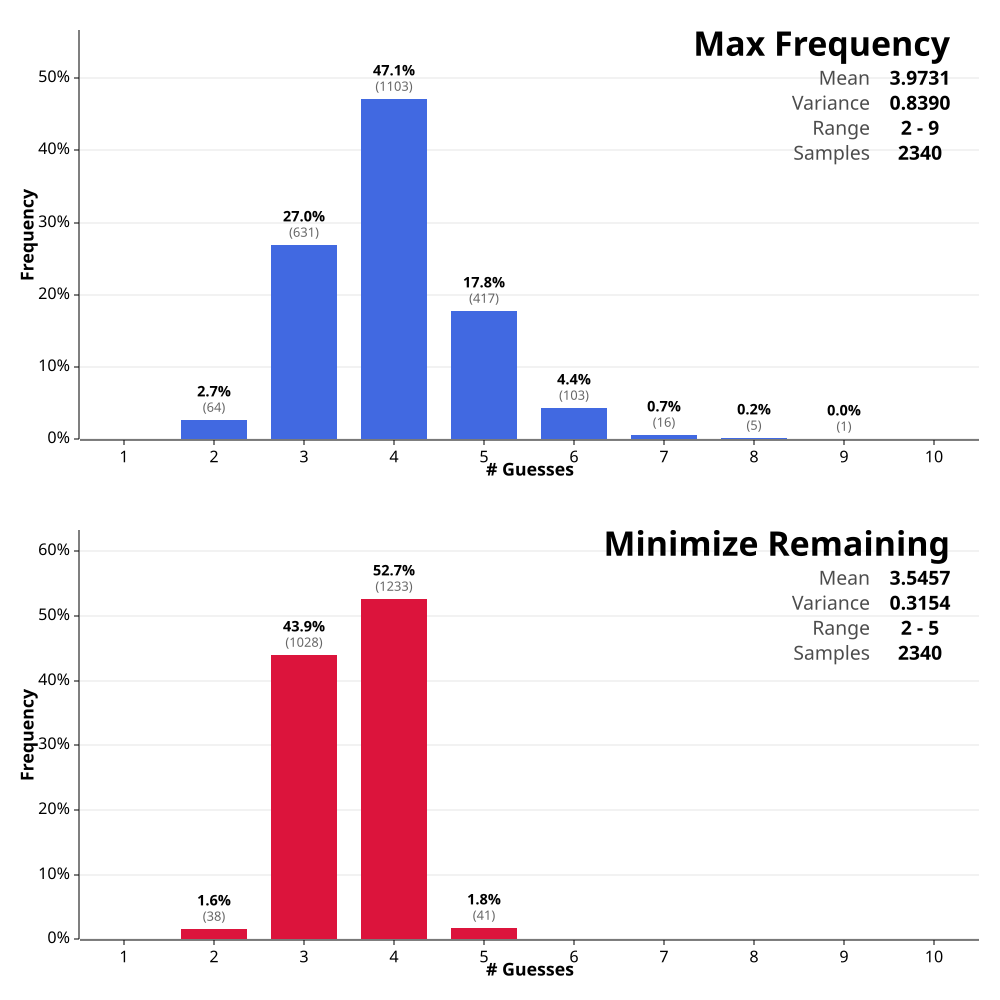

# Wordle Solver

A solver for the popular word guessing game Wordle.

The primary goal of this project was to learn how to use Rust. This goal has been accomplished. 

A secondary goal was to then compute the true optimal strategy feasibly, instead of using a heuristic. This goal has been partially accomplished. This repository implements a valid algorithm that computes the optimal strategy, but in order to run it on my laptop, it would take multiple days. 

The section "An Attempt to Compute the Optimal Strategy" lays out the key ideas leading to my implementation.

## Code

The code provided in this repository consists of the following:

- Standardized word lists.
- Implementation of multiple policies including max-frequency, min-remaining, and the optimal policy.
- Functions to build, store and retrieve the optimal strategy cache.
- A simulation engine to evaluate the performance of any policy.
- Graph generation to neatly compare the performance of difference policies.
- Standardized and highly efficient functions to compute responses, and partitions.
- A CLI tool to: play wordle using any policy, generate the optimal strategy cache, and create policy comparison charts.




# An Attempt to Compute the Optimal Strategy

## Word sets

The game of Wordle relies on a definition of the following components.

Each of the following sets contain words of length $N_c$, with characters A-Z, where $N_c = 5$ in classic Wordle.
- The set of allowed guesses $G$.
- The set of (remaining) candidates $C$. We will denote the initial (complete) set of candidates using $C_0$, such that $C \subseteq C_0 \subseteq G$. We assume it is equally probable for all initial candidates to be the secret word.
- The set of all possible responses $R$. Where each character in a response is either green, yellow, or gray. We will the denote the all green response using $r_w$ ("win" response).

## Response function

The response to a guess may be defined using a function $f: (C\times G) \to R$.

This function maps each candidate $c \in C$, guess $g \in G$ pair to the corresponding response $r \in R$ that would be given by Wordle if the $c$ was the secret word, and you guessed $g$.

```plaintext
function compute_response(secret, guess):
    N_c = length(secret)
    assert N_c == length(guess)
    response = array(N_c, GRAY)
    used = array(N_c, false)
    
    // Pass 1: find greens
    for i in 0..N_c-1:
        if guess[i] == secret[i]:
            response[i] = GREEN
            used[i] = true
    
    // Pass 2: find yellows
    for i from 0..N_c-1:
        if response[i] == GREEN:
            continue
        for j in 0..N_c-1:
            if guess[i] == secret[j] AND !used[j]:
                response[i] = YELLOW
                used[j] = true
                break
    
    return response
```

Intuitively, the total number of distinct responses $|R| = 3^{N_c}$. But some of these responses are impossible. Namely, all $N_c - 1$ green $1$ yellow responses. 

## Partitions

We may partition a candidate set $C$ into subsets $C_{g,r}$, for each guess $g \in G$ response $r \in R$ pair. Where $C_{g,r}$ is the set of words $c\in C$ that would generate response $r$ if $g$ were guessed.

$$C_{g,r} = \{c \in C \mid f(c, g) = r\}$$

Properties: 
- $r_1 \neq r_2 \to C_{g,r_1} \cap C_{g,r_2} = \emptyset$
- $g \in C_{g,r} \to C_{g,r} = \{g\} \land r=\text{all green}$.
- $C_{g,r} = C_{0,g,r} \cap C$

## As a Markov Decision Process

Using the aforementioned definitions, the full game of Wordle may be defined as an infinite horizon Markov Decision Process (MDP) as follows.

- Each state $s$ is just the set of remaining candidate words $C$. We add a terminal win state $\emptyset$ for when the secret word has been guessed correctly. Using this definition, the set of all states $S$ is exactly the power set of the initial candidate set $C_0$.
- Each action is a guess $g \in G$.
- The transition function $P(s' \mid s, g)$ defines the probability of transitioning to a next state $s'$ given current state $s$ and guess $g$.

$$P(\emptyset \mid C, g) = \begin{cases} \frac{1}{|C|} & \text{if } g \in C \\ 0 & \text{otherwise} \end{cases}$$

$$P(C_{g,r} \mid C, g) = \frac{|C_{g,r} \setminus \{g\}|}{|C|}$$

$$P(\emptyset \mid \emptyset, \cdot) = 1$$

  - The cost function $Cost(s)$ penalizes every guess made.

$$Cost(s) = \begin{cases} 0 & \text{if } s = \emptyset \\ 1 & \text{otherwise} \end{cases}$$

  - The discount factor $\gamma = 1$

The goal is to find an optimal policy, $\pi^{\ast}(s) \to g$, that minimizes the total expected cost (total expected number of guesses).

Substituting these values into the Bellman optimality equations and simplifying gives:

$$Q^{\ast}(C, g) = 1 + \sum_{r \in \hat{R} } \frac{|C_{g,r}|}{|C|} V^{\ast}(C_{g,r})$$

$$V^{\ast}(C) = \min_{g \in G} Q^{\ast}(C, g)$$

Where $\hat{R} = \{r \in R \mid r \neq r_w \}$ is the set of all possible responses excluding the win response.

## Computing the Optimal Strategy feasibly

### The infeasibility

The reason we can't compute the optimal strategy in polynomial time is because the number states is exponential in the number of initial candidates.

$$|S| = 2^{|C_0|}$$

In order to make the algorithm feasible, we must drastically reduce the number of states to visit.

A first insight is to realize that not all states are reachable from $|C_0|$, however, an attempt to find all reachable states via a BFS traversal will quickly show that even this simplified problem is still intractable, showing the same exponential growth.

A next insight is then, that many of these states are only reachable by making terrible guesses that clearly don't correspond to the optimal value. For example, a guess filtering out only one candidate will lead to a new distinct state, but this state is likely irrelevant to the optimal strategy.

These insights combined lead to the following algorithmic optimizations.

### Integer optimization: Minimizing total cost

To avoid the computational overhead and precision issues of floating point arithmetic, we reformulate the objective function. Instead of minimizing the expected number of guesses (which requires division), we minimize the total number of guesses required to solve for all candidates in $C$.

Let $T^{\ast}(C)$ be the minimum total guesses for candidate set $C$. We can define the relationship to the expected value $V^{\ast}(C)$ as:

$$T^{\ast}(C) = |C| \cdot V^{\ast}(C)$$

We can then update the Bellman Equations as follows:

$$T^{\ast}(C) = |C| \cdot V^{\ast}(C) = \min_{g \in G} \left( |C| \cdot 1 + |C| \sum_{r \in \hat{R}} \frac{|C_{g,r}|}{|C|} V^{\ast}(C_{g,r}) \right) = \min_{g \in G} \left( |C| + \sum_{r \in \hat{R}} T^{\ast}(C_{g,r}) \right)$$

This gives the integer-only recurrence relation. Note that the term $|C|$ represents the fact that the current guess $g$ adds exactly 1 guess to the path of every candidate currently in the set.

Rewriting the recurrence relation in alternating recursive form we get:

$$T^{\ast}(C) = \min_{g \in G} T^{\ast}(C, g)$$

$$T^{\ast}(C, g) = |C| + \sum_{r \in \hat{R}} T^{\ast}(C_{g,r})$$

### Base Cases

- Empty Set: $T^{\ast}(\emptyset) = 0$
- Single Word: $T^{\ast}(\{c\}) = 1$ 
  - The word is guessed immediately.
- Two Words: $T^{\ast}(\{c_1, c_2\}) = 3$.
  - 1 guess identifies the first word.
  - 2 guesses identifies the second. 
  - Total: $1+2=3$.

### Memoization

We use a memoization to store T^{\ast}(C) for each set of candidates $C$ where $|C| > 2$.

### Max distinct responses 

A very important optimization comes from quantifying the "capacity" of the Wordle game tree. We want to know the maximum number of candidates that can be distinguished in a single step.

Definition (Branching Factor): Let $\rho(C, g)$ be the number of distinct responses generated by a guess $g$ against a candidate set $C$:

$$\rho(C, g) = |\{ r \in R \mid \exists c \in C, f(c, g) = r \}|$$

We define the Max Branching Factor $K(C)$ as the maximum possible distinct responses achievable by any single guess:

$$K(C) = \max_{g \in G} \rho(C, g)$$

Theoretical vs. Practical Limits: 
- Combinatorial Limit: The absolute maximum number of distinct responses for length 5 words is $|R| - 5 = 243 - 5 = 238$. (It is impossible to have exactly 4 Greens and 1 Yellow).
- Practical Limit: Due to the correlations between English words (shared substrings), no single guess can actually achieve 238 partitions.

Optimization Lemma (Global K): Computing $K(C)$ is an expensive operation ($O(|G|\cdot|C|)$). However, we rely on the property that the branching factor is monotonic with respect to set inclusion. If $C' \subseteq C$, then for all $g$, $\rho(C', g) \le \rho(C, g)$. Consequently:

$$K(C') \le K(C)$$

This implies the max branching factor of the initial set of candidates $K_{0} = K(C_0)$ is larger than or equal to any other max branching factor $K(C)$.

### Lower bounds on $T^{\ast}(C)$

In a minimization problem, we require admissible lower bounds (optimistic estimates) on the cost to perform pruning.

Bound 1 (Information Theoretic):Each response from Wordle provides information that reduces the candidate set. To distinguish among $|C|$ possibilities requires at least $\log_{|R|}(|C|)$ responses in expectation. Converting this to total guesses:

$$T^{\ast}(C) \geq |C| \cdot \log_{|R|} |C| = |C| \cdot \gamma \log_2 |C|$$

Where $\gamma = 1 / \log_2(|R|) = 1 / \log_2(3^{N_c}) = 1 / (N_c \cdot \log_2(3))$.

Bound 2 (Minimum Depth / Pigeonhole): We derive the absolute minimum number of total guesses required for a set of size $|C|$ by assuming the best-case scenario for every guess. 
1. We must pick a single guess $g$. 
2. If the secret word happens to be $g$ we solve it in 1 guess. This happens for at most one candidate in $C$.  
3. For the remaining $|C| - 1$ candidates, the guess $g$ is incorrect. Therefore, we need at least 1 additional guess to solve them. Giving a path length of at least 2.

$$T^{\ast}(C) \geq 1 \cdot 1 + 2 \cdot (|C| - 1) = 2|C| - 1$$

Bound 3 (Capacity Bound Pigeonhole): Using the branching factor $K$ we can tighten the lower bound for large sets ($|C| > K$). The standard Pigeonhole bound assumes we can solve all remaining candidates at Depth 2. However, we are physically limited by the number of distinct buckets (responses) available. 

1. Depth 1: We can identify at most 1 candidate (the secret word itself).
2. Depth 2: We can identify at most $K-1$ distinct candidates. (One distinct response per candidate, minus the "Win" response used at Depth 1).
3. Depth 3: Any remaining candidates must be solved at Depth 3 or greater.

Derivation: Let $N = |C|$. If $N > K$, the minimum configuration of guesses is:
- 1 candidate at cost 1.
- $K-1$ candidates at cost 2.
- The remaining $N - 1 - (K - 1) = N - K$ candidates at cost 3 (optimistically).

$$T^{\ast}(C) \geq 1(1) + 2(K - 1) + 3(N - K) = T^{\ast}(C) \geq 3|C| - K - 1$$

> Note: While this geometric capacity constraint extends to deeper levels (Depth 4, 5, etc.), for standard Wordle the remaining candidates always fit within Depth 3 (since $K^2 ≫∣C∣$), making further expansion unnecessary.

The tightest lower bound $L(C)$ is just the maximum of all lower bounds. Assuming $N_c = 5$, Bound 2 is tighter than bound 1 for all relevant candidate set sizes. On top of this, its also more efficient to compute. Bound 3 is tighter than bound 2 $|C| > K$.

Finally, we may compute a lower bound on the specific total cost of a guess $T^{\ast}(C,g)$ by using the actual computed optimal value $T^{\ast}(C_{g,r})$ where available (memoized), and the lower bound $L(C_{g,r})$ otherwise.

$$T_{LB}(C, g) = |C| + \sum_{r \in \hat{R} } \hat{T}(C_{g,r})$$

where:

$$\hat{T}(S) = \begin{cases} T^{\ast}(S) & \text{if } S \text{ is in cache} \\ L(S) & \text{otherwise} \end{cases}$$

### Upper bounds on $T^{\ast}(C)$

An upper bound on $T^{\ast}(C)$ can be computed using a greedy strategy (heuristic). Since we are minimizing cost, the total cost produced by any valid policy $T^\pi(C)$ is a valid upper bound on the true minimal total cost $T^{\ast}(C)$.

Let $\pi(C)$ be a heuristic policy function that returns a guess $g$ for a set $C$. We can calculate the total cost by simulating the game tree using $h(C)$ recursively.

$$T^{\ast}(C) \leq UB(C)$$

We use this $UB(C)$ to initialize our search. If we find a branch in our search tree with a lower bound exceeding $UB(C)$, we know that branch cannot possibly beat our heuristic, and we can prune it.

### Pruning

To solve the problem within a reasonable timeframe, we employ a Branch and Bound strategy to eliminate (prune) guesses that cannot possibly yield an optimal solution. We track the best solution found so far for the current set $C$, denoted as $\beta$, and discard any guess $g$ whose lower bound cost exceeds this value.

The pruning logic proceeds as follows:
1. Initialization ($\beta$): We first compute an upper bound for $T^{\ast}(C)$ using a heuristic policy. We set our initial best-known cost $\beta$ to this value. $$\beta \leftarrow UB(C)$$
2. Guess Ordering: We sort the allowed guesses $g \in G$ based on the heuristic score. Processing promising guesses first allows us to lower $\beta$ earlier in the search, increasing the effectiveness of pruning for subsequent guesses.
3. Incremental Lower Bound Refinement: 
   1. For each guess $g$, we calculate an initial lower bound $T_{LB}(C, g)$ using the static lower bounds $L(S)$ (or memoized values if available) for all resulting partitions. $$T_{LB}(C, g) = |C| + \sum_{r \in \hat{R}} \hat{T}(C_{g,r})$$ 
   2. If $T_{LB}(C, g) \geq \beta$, the guess is immediately pruned. Otherwise, we incrementally refine it by computing the exact costs of the sub-problems.
   3. We iterate through the partitions $C_{g,r}$ sorted by size in descending order. We prioritize larger partitions because they contribute the most to the total cost, causing $T_{LB}$ to rise faster and triggering prune conditions earlier.
   4. For each partition $C_{g,r}$: If the exact cost $T^{\ast}(C_{g,r})$ is not yet known (not in cache), we recursively compute it. We update the running lower bound for the guess by replacing the optimistic estimate $L(C_{g,r})$ with the actual cost $T^{\ast}(C_{g,r})$. $$T_{LB}(C, g) \leftarrow T_{LB}(C, g) + \left( T^{\ast}(C_{g,r}) - L(C_{g,r}) \right)$$
   5. Check: After every update, if $T_{LB}(C, g) \geq \beta$, we stop processing partitions for this guess and prune it immediately.
4. Update Best:If we fully evaluate a guess $g$ (all partitions solved) and the final cost is strictly less than $\beta$, we update our best known solution:$$\beta \leftarrow T_{LB}(C, g)$$

### Dynamic Search Space Reduction

To further optimize the algorithm, we observe that as the set of candidates $C$ shrinks, the set of useful guesses $G$ also shrinks. Iterating over the full set of all allowed guesses (approx. 13,000) is wasteful when $|C|$ is small, as most guesses will yield zero information (fail to partition $C$).

We can dynamically maintain a reduced list of guesses $\hat{G}$ to pass down the recursion tree. A guess is considered "relevant" for a candidate set $C$ only if it has the _potential_ to distinguish between the remaining candidates. 

We use a simple rule: if a guess fails to partition $C$, it will fail to partition any of its subsets $C_{g,r}$. Every time we compute the partitions for a guess $g$ given the current set $C$, we filter out all guesses that fail to partition any of the resulting partitions.

### Representing $C$

The choice of data structure for the candidate set $C$ is really important. Let $N = |C_0|$ be the total number of initial candidates and $k = |C|$ be the number of elements in the current set ($k \le N$).

| Attribute / Operation                     | Bitset (based on $N$) | Sorted List of Indices (based on $k$) |
|:------------------------------------------|:----------------------|:--------------------------------------|
| **Space**                                 | $O(N/64)$             | $O(k)$                                |
| **Time to get element count**             | $O(N/64)$             | $O(1)$                                |
| **Time for intersection/union**           | $O(N/64)$             | $O(k_1 + k_2)$                        |
| **Time to check membership** ($i \in C$?) | $O(1)$                | $O(\log k)$                           |
| **Time to hash**                          | $O(N/64)$             | $O(k)$                                |
| **Time to iterate over elements**         | $O(N/64)$             | $O(k)$                                |
| **Time to create an empty set**           | $O(N/64)$             | $O(1)$                                |
| **Time to add an element**                | $O(1)$                | $O(k)$                                |
| **Time to add a maximum element**         | $O(1)$                | $O(1)$                                |

## Heuristics

### Pick Max Frequency

**Goal**: Maximize coverage of common letters across candidates.

Letter frequency across C:

$$\text{freq}(\ell) = |\{c \in C ~|~ \ell \in c\}|$$

For each guess $g$, score by unique letters:

$$\text{score}(g) = \sum_{\ell \in \text{unique}(g)} \text{freq}(\ell)$$
- where $\text{unique}(g)$ is the set of distinct letters in $g$. 

The approximation of the optimal guess is the guess that maximizes the score:

$$g^{\ast} = \arg\max_{g \in G} \text{score}(g)$$

### Pick Min Remaining

**Goal**: Minimize expected number of remaining candidates after the guess.

Expected remaining candidates for a given guess $g$:

$$\mathbb{E}[|C_{g,r}|] = \sum_{r \in R} \frac{|C_{g,r}|}{|C|} \cdot |C_{g,r}|= \frac{1}{|C|} \sum_{r \in R} |C_{g,r}|^2$$

$|C|$ is independent of the guess, so we leave it out in the score.

$$\text{score}(g) = \sum_{r \in R} |C_{g,r}|^2$$

The approximation of the optimal guess is the guess that minimizes the score:

$$g^{\ast} = \arg\min_{g \in G} \text{score}(g)$$
